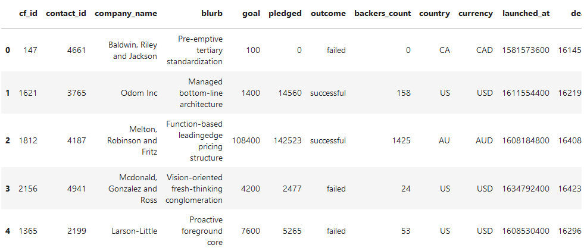
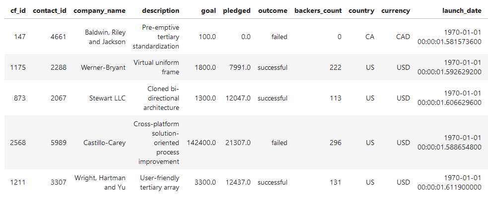
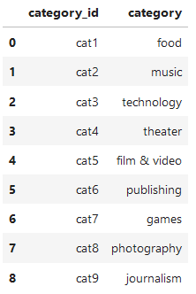
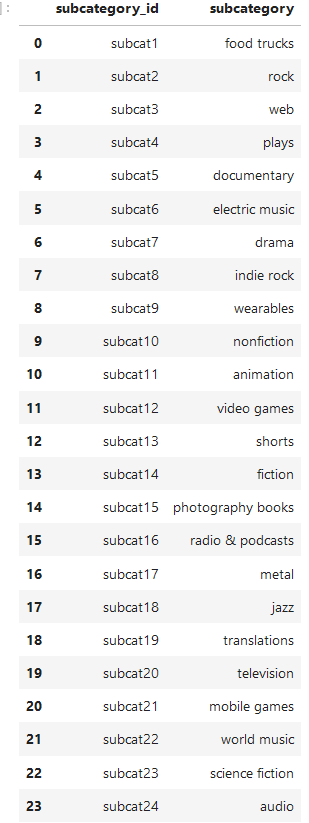
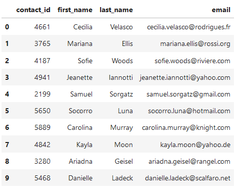
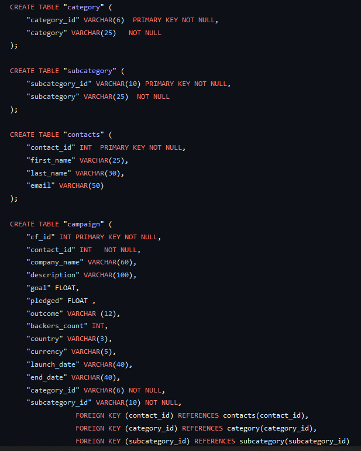

# Crowdfunding_ELT

### Contributors 
Acarie Jenkins and Katharyn Hogle

## Goal
The intention of this project was to extract data from Excel files provided by the Bootcamp, clean and reformat the data for best use, and export the more proficient tables into CSV files to create an SQL schema.

## Snapshots of DataFrames
### Original DataFrame

### Campaign DataFrame

### Category DataFrame

### Subcategory DataFrame

### Contacts DataFrame

### Schema of the four new tables

### Work Cited 
All code was taken and reformatted as needed from class assignments. 
TA Kyle assisted with solving an error with the provided code.
